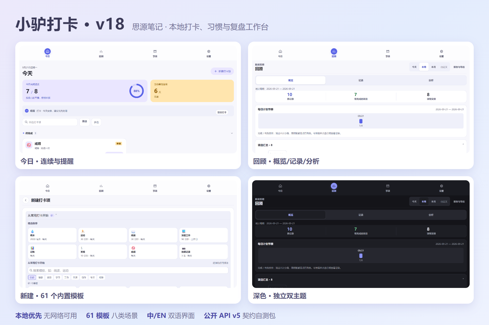
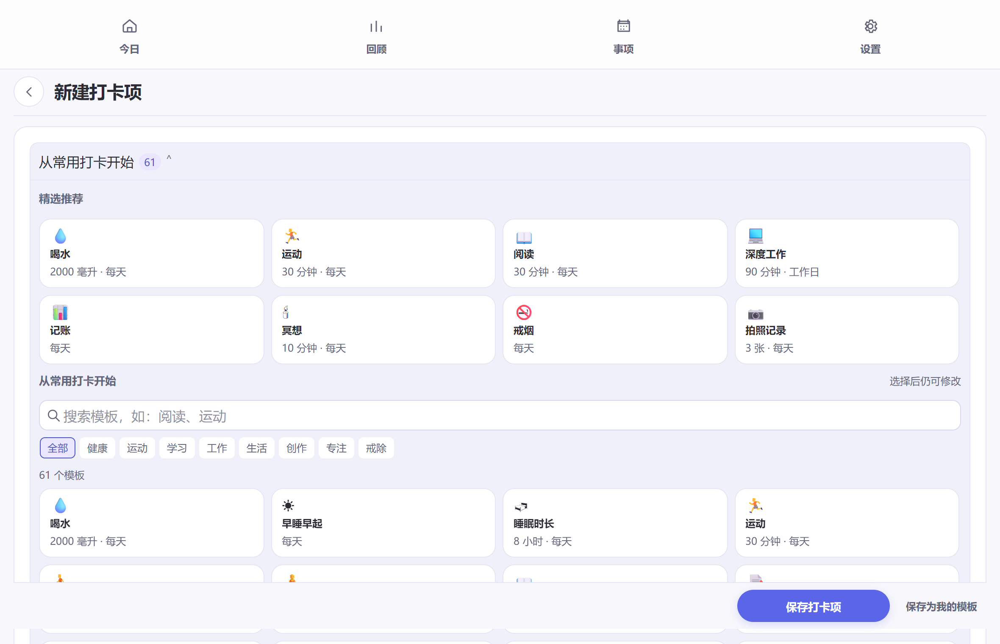

<div align="center">


# 小驴打卡

**思源笔记 · 本地打卡、习惯与复盘工作台**

记录每一次行动，再用同一份可追溯数据完成统计、提醒、复盘和跨插件协作。

**当前版本：18.6.0**

[最新 Release](https://github.com/ai68298100/siyuan-checkin/releases/latest) · [完整变更记录](docs/releases/release-notes-18.6.0.md) · [问题反馈](https://github.com/ai68298100/siyuan-checkin/issues) · [开发文档](docs/)

</div>

---

<div align="center">

</div>

---

## 30 秒了解

| 你想做什么 | 从哪里开始 |
| --- | --- |
| 今天快速完成习惯 | **今日**：点击完成、`+1`、输入精确值，或直接跳过并留下原因 |
| 记录时长/喝水/页数等数值 | **新建**：选择时长、数量或自定义单位；支持手动记录，也可进入番茄钟 |
| 看趋势和复盘 | **回顾**：趋势、热图、日志、强度、周期对比、成就与建议 |
| 管理生日、账单、续费 | **日期事项**：一次性、周期或农历规则，集中查看提醒 |
| 迁移或备份数据 | **设置**：导入/导出 JSON、CSV、Markdown，以及恢复点和审计 |

### 快速安装

1. 打开 [GitHub Releases](https://github.com/ai68298100/siyuan-checkin/releases)，下载对应版本的 `package.zip`。
2. 在思源中打开“设置 → 集市 → 下载安装包”，选择压缩包安装。
3. 重载插件，从顶栏按钮、命令面板或移动端入口打开。

当前完整验证基线为思源 **v3.8.4**；低于该版本时思源会禁用插件。首次升级前建议从设置页导出 JSON 备份。

### 适合谁

- 想在思源内维护本地习惯、行动记录和复盘数据；
- 需要同时记录完成次数、时长、数量、自定义单位或戒除目标；
- 使用番茄钟，但仍希望保留不启动计时器的手动记录入口。

插件是本地优先工具，不提供云端同步、社交排行榜或系统级后台通知。

## 这是什么

小驴打卡是一个以本地数据为中心的思源笔记插件。它可以记录一次完成、次数、时长、数量或自定义值，按照计划生成今天的待办机会，并在回顾页提供趋势、热力图、日志、成就和行动建议。

核心功能不依赖网络或 AI：即使没有智能体、番茄钟或其他插件，手动打卡、统计、导出、恢复和提醒仍然可以独立运行。插件不包含 `kernel.js`，不声明 `kernels`，也不启用 `publish.data`；打卡记录、恢复点、审计信息和显示偏好属于插件自己的本地数据。

## 18.6.0 要点

本版交付问卷式日记打卡（打卡即写日记）、数值快捷增量、年度分享图导出与里程碑分级庆祝，并落地低压力呈现基线（双日规则文案、色盲安全色阶冗余编码、移动 44px 触控目标）与确定性相关性洞察。主存储 v3、最低思源版本 3.8.4 不变，可直接从 18.5.0 升级。

- **问卷式日记**：项目绑定问卷模板（感恩三问、五分钟日记、九宫格晨间日记、KPT 复盘、周记 5 个预设或自建），打卡时弹出问卷，完整内容写入当日日记或指定文档；重填幂等更新、不重复记账。
- **快捷记录**：数值项目可配预设增量按钮（如 +250/+500）一键记录；今日行动台摘要条升级完成度环；回顾统计区新增近 30 日趋势迷你线。
- **洞察与分享**：报告新增项目间相关性洞察（最小样本纪律，附「相关不等于因果」说明）；month 块超额日正向描边、today 块分时段计数；一键导出年度分享图（本地生成 PNG）。
- **低压力基线**：失速卡「双日规则」文案、calm 文案禁则、色盲安全色阶冗余编码、移动端 44px 触控目标、连击里程碑分级庆祝、66 天习惯成熟度参考刻度。
- **质量**：守门 182 个测试文件、真实思源内核 E2E 22 场景、诊断导出结构化预览、Loop CSV 未识别列导出前点名与向前兼容承诺。

完整条目见 [18.6.0 变更记录](docs/v18.6.0-change-log.md)、[发布说明](docs/releases/release-notes-18.6.0.md)。

## 18.5.0 要点

本版完成设置页与外部联动的重新分组，补齐思阅、健康、思播、微信读书、叶归 LifeLog 的配置边界与单位守门，并修复移动端已完成打卡项折叠交互。主存储 v3、最低思源版本 3.8.4、契约 storeVersion 2 不变，可直接从 18.4.0 升级。

- **设置页分组**：将思源文档写入（日记、摘要）与第三方来源联动（思阅、健康、思播、微信读书、叶归）分开；每个来源独立卡片显示绑定目标、保存/启用步骤、本地状态、数据流、隐私边界、停用保留和重绑说明。
- **外部联动守门**：时长来源要求分钟项目；健康来源校验指标单位、日期与查询上限；思播显示宿主 controller 可用状态；微信读书 Key 只存本地偏好并支持独立的时长、完读、笔记目标；叶归只读取绑定笔记本中的当日 Marker 块。
- **手机端折叠**：已完成打卡项支持展开、折叠、恢复，按钮同步 aria 状态与隐藏列表并保留偏好。
- **质量与发布工程**：完整质量链覆盖 175 个测试文件、移动视觉矩阵、真实性能、生态契约、发布清单和回滚演练；修复构建时间戳导致的发布摘要时序问题。

完整条目见 [18.5.0 变更记录](docs/v18.5.0-change-log.md)、[发布说明](docs/releases/release-notes-18.5.0.md)。

## 18.4.0 要点

本版交付微信读书官方接入（official-pull 渠道首租户）、每日提醒调度、回顾行动卡补齐（目标负荷解读/调整有效性）、渲染块组合卡片与场景组合包，并修复后台渲染死锁、填写面板被后台事件收起、回车保存后界面不刷新等真实交互缺陷。主存储 v3、最低思源版本 3.8.4、契约 storeVersion 2 不变，可直接从 18.3.0 升级。

- **微信读书联动**（opt-in 默认关）：官方 Agent API 三链路——每日阅读分钟达阈值记一次、每读完一本记一次、每日笔记条数（划线+想法）；`weread:` 幂等+墓碑，断网静默降级；Key 仅存本地偏好。接入步骤见 [微信读书接入指南](docs/weread-integration.md)。
- **每日提醒**：统一推送当日逾期/待完成/事项为一条思源原生通知（事项置顶）；可配最多 4 个提醒时刻（每时刻每日一条），安静时段与零事项不打扰；留空保持「启动后一条」。
- **回顾四卡**：失速排名、漏卡星期/时段分布、目标负荷解读（目标是否过高，样本门槛下的推断）、调整有效性对比——每个图表给可行动结论；跳过原因分布新增「常发生在星期几」交叉行。
- **组合卡片与场景组合包**：渲染块可编排 1~3 个既有视图；新建页新增 5 个场景模板组（晨间/学习/运动/睡前/创作），预览后逐条填表确认。
- **交互修复**：后台事件不再收起展开中的填写面板；回车保存立即刷新；手机端滚动振荡、输入法弹回、按钮文字竖排三项修复。

完整条目见 [18.4.0 变更记录](docs/v18.4.0-change-log.md)、[发布说明](docs/releases/release-notes-18.4.0.md)。

## 18.3.0 要点

本版把生态调研第三轮采纳项与产品战略落地路线（R-A0～A12 泳道）的本地可交付部分一次收口：习惯算法、今日页、提醒、隐私披露与生态契约全面增强。主存储 v3、最低思源版本 3.8.4、契约 storeVersion 2 不变，可直接从 18.2.1 升级。

- **戒断里程碑**：戒除类项目显示「戒断第 N 天」并对照 1/3/7/14/30/60/90/180/365 阶梯给出最近达成级与下一关；今日卡片、summary 渲染块与公开 API `getStreaks` 同口径。
- **今日行动台摘要条**：今日页顶部一眼看清完成进度、跳过数、推荐的下一步与专注可用性；记录路径与撤销不变。
- **提醒注意力**：新增「安静时段」窗口（支持跨午夜），窗口内提醒降级为页内安静呈现；提醒中心新增「延后2小时」防抖。
- **命名保存视图 + 范围导出**：回顾页可把「最近 30 天 + 来源」存为命名视图一键应用；CSV 导出支持相对天数范围（JSON 恒为全量备份）。
- **隐私披露**：导出前审计并披露备注/图片数量；来源断开时明示已落盘事件与幂等身份全部保留；诊断导出前预览包内构成；删除/批量删除确认含影响清单。全程零遥测。
- **渲染块一键插入**：命令面板提供 4 个预设（汇总/月历/热力图/分组概览），插入即可正确渲染。
- **渲染块组合卡片**：一个 checkin 块可编排 1~3 个既有视图（如汇总+月历），子配置白名单校验、禁嵌套，交互（日期跳转等）原样可用。
- **导入预览**：Loop CSV 与 Obsidian Habits 21 导入前统一披露重名合并与语义损耗。
- **报告增强**：报告头显式声明统计范围；新增「跳过原因分布」节（词表归一化 + 样本不足守卫）与「失速项目」节（30 天漏卡排名）。
- **质量基建**：日期运算单一实现（date-keys）、架构边界自动守门、UI 状态台账、Task Horizon 消费侧契约（单飞/超时/Abort/降级）、来源生命周期矩阵。

### 18.2.1 功能基础

外部来源体验收口：修复思播采样累计与健康收件箱身份两处缺陷，设置页外部来源入口聚合为折叠面板，回顾报告来源筛选覆盖思阅/思播。

- **修复·思播观看联动**：此前按单段采样取整，15 秒采样无法累计到 1 分钟；现按原始毫秒累计、按分钟晋升，时长项目可正常达标。
- **修复·健康收件箱**：幂等身份补入项目维度，多个健康项目绑定同一指标不再互相覆盖；启动时立即同步一次收件箱。
- **设置页**：日记/摘要驻留/思阅/思播/健康五组外部来源入口收进折叠面板，摘要行显示已启用数；思阅/思播行内显示今日累计分钟。
- **回顾**：报告来源筛选新增「思阅阅读」「思播观看」，同时作用于报告与偏差基线。

### 18.2.0 功能基础

本次小版本交付生态调研循环（T-1400/D-256）第一轮的全部采纳项，并新增思播观看联动（实验）与极简「今日视图」渲染块。

- **极简「今日视图」渲染块**：`{"view":"today","itemIds":[...]}`——今日状态/连续/最近漏卡日概览 + 一键打卡按钮（完成后祝贺态），可嵌入日记或仪表盘笔记。
- **思播观看联动**（实验，opt-in 默认关）：有界轮询思播 controller 播放态，累计有效观看分钟达阈值后每日一次幂等打卡；seek/变速不污染数据。
- **容错连续（maxGap）**：项目级「漏打容错（天）」——漏打不超过 N 天不断签，缺口不计入连续；与跳过日正交。
- **热力图色阶自适应**：四级色阶按个人记录分布自动分级，低频用户同样有完整层次。
- **完成庆祝动效**：打卡反馈 ✓ 徽标轻弹一次；尊重系统与插件内的减弱动效偏好。

### 18.1.0 功能基础

外部数据来源正式接入：思阅阅读联动、健康数据收件箱（iOS 快捷指令）、每日摘要驻留（均 opt-in 默认关）；来源统筹框架统一五段管道；Task Horizon 日历可见性 + 公开 API 新增 `calendar.read`；锚点跳转跟随块移动。

完整条目见 [18.3.0 变更记录](docs/v18.3.0-change-log.md)、[发布说明](docs/releases/release-notes-18.3.0.md)、[18.2.1 变更记录](docs/v18.2.1-change-log.md) 和 [18.2.1 发布说明](docs/releases/release-notes-18.2.1.md)。

- **回顾适配**：修正统计周期与内容对齐、记录数值垂直居中、图表随容器宽度展开及窄屏字号；调整移动端回顾滚动。
- **中文输入**：今日搜索在拼音组合期间保留输入节点，防止旧搜索计时器中断输入。
- **头像设置**：支持预设、文字和照片头像；照片可拖动取景、缩放、重置或取消，损坏或超长图片数据不会被截断保存。
- **日记文档**：可搜索选择目标文档，也可选择打开的笔记本新建文档；失败原因分别提示，保留手填文档 ID。
- **回顾助手**：复制提问后尝试打开思源智能体面板；面板不可用时保留复制结果并提示手动打开。

间隔复习、项目文档绑定、每日日记、同类产品及闪卡联动的研究结论见[研究路线](docs/roadmap-checkin-research-2026-09.md)；采用项已拆入当前实现批次，剩余项按真实宿主、外部排期或用户决策保持开放。完整战略和执行路线见[产品战略](docs/roadmap-product-strategy-2026-09.md)与[落地路线](docs/implementation-roadmap-product-strategy-2026-09.md)。真实思源宿主、Android 输入与触控、只读/发布服务及双插件联调仍有待验收项，详见[18.2.1 发布说明](docs/releases/release-notes-18.2.1.md)。

完整条目见 [18.1.0 变更记录](docs/v18.1.0-change-log.md) 和 [18.1.0 发布说明](docs/releases/release-notes-18.1.0.md)。

### 18.0.1 功能基础

本版本聚合模板体系、笔记原生、受控智能体与生态准入四个方向的交付。主存储结构不变，可直接从 17.3.0 升级。

- **模板体系**：内置模板扩充到 **61 个**（健康/学习/运动/工作/生活/戒除/专注/创作八类，中英双语），新建页新增「最近使用」与「精选推荐」，分批展示不再一次平铺全部。
- **界面语言**：设置可选 中文 / English / 跟随思源；英文界面完成与中文同标准的全端走查审计。
- **回顾导出增强**：报告自动生成目标偏差解释（提升/下降/持平/数据不足），支持按事件来源筛选（当期与基线同口径），新增「导出全部」（JSON + CSV + 报告）。
- **受控智能体**：排期调整类建议经确认后执行、可撤销；智能体可起草新项目（进入普通编辑器检查后由你保存，不直接写入）；建议审计轨迹可导出诊断 JSON。
- **日记集成（默认关）**：把本周/本月报告手动写入你绑定的思源文档，只追加、不改动既有内容。
- **数据诊断**：保存失败、版本冲突、导入被拒等输出结构化原因码，设置页可查最新状态并导出诊断 JSON；恢复指南内置。
- **渲染块升级**：`​```checkin``` 块支持多分组聚合视图、完成率阈值过滤与项目/锚点跳转。
- **生态自测包**：第三方插件可用 `siyuan-checkin-contract` 包在开发期自测 API 兼容性（78 项断言 + 五项准入清单）。

完整条目见 [18.0.1 变更记录](docs/v18.0.1-change-log.md) 和 [GitHub 发布说明](docs/releases/release-notes-18.0.1.md)。

## 历史版本摘要

### 17.2.x / 17.3.0 维护重点

- **回顾工作区**：概览/记录/分析三任务视图，首屏只展示当前任务需要的内容；趋势、热图、强度、对比按需展开。
- **统计口径**：跳过日不进入完成率分母；按日目标与周期配额分别表达；配额不再显示不可比较的完成率差值。
- **公开 API v5**：范围事件读、幂等批量写、统一项目投影、指标门面与 `capabilitiesSince` 版本协商。
- **番茄钟联动修复**：会话归属、按会话停止、完成回写收件箱与手动管理旅程。
- **原生容器导出通道**：手机端导出先写工作区 `assets/` 再交系统保存面板，杜绝 `blob:` 导航导致思源重启。
- **智能体状态自证**：设置页区分宿主支持状态与注册失败原因，注册与存储读取解耦。

## 历史版本摘要

17.0.0 及更早版本的维护重点保留在下方，完整细节请查看 [发布记录目录](docs/releases/)。

### 17.0.0 维护重点

- **跳过态**：Today 卡菜单可「跳过今日」（可填原因、可撤销），批量模式支持跳过；跳过日不断连击、不计入完成率分母、不吃配额，热力图与月历以中性色呈现。存储 v2→3 在加载时自动迁移，历史数据无损。
- **习惯强度**：每项目 0~100 的强度分数（半衰期模型，跳过日与非计划日冻结）；回顾页强度卡以总览曲线优先、单项趋势收入二级视图；洞察页新增强度两周变化与 sigmoid 成熟度（66 天参考线）。
- **范围对比**：回顾页可对比任意两个周期的记录、完成与安排增减，并给出逐项目差值；周报/月报五区块模板可配置，一键导出 Markdown。
- **负向目标**：新增「戒除类目标」——不记录即成功、记录即破戒，连击按连续无破戒日计算；Today 卡按语义切换「记破戒 / 撤销破戒」，无破戒日显示「今日已避开」；随附戒烟、戒奶茶等五个戒除模板。
- **笔记锚点回写**（opt-in）：项目可绑定思源块/文档，打卡状态回写为 `custom-lv-checkin` 自定义属性，备注与跳过原因可追加为锚点文档子块；回写失败自动挂起并入审计，不阻断打卡，解绑或卸载时清除插件写入的属性。
- **声明式渲染块**：在文档代码块中写 `checkin` JSON 配置即可渲染月历 / 热力 / 汇总视图，支持项目、分组、全部三种作用域与色阶配置；点击日期跳转当日详情，打卡后自动刷新。
- **Loop Habit Tracker 迁移**：导入官方导出的 Habits.csv / Checkmarks.csv，并可导出 Loop 兼容双文件；四条导出、三条导入通道均有测试锁定。
- **Obsidian Habit Tracker 21 迁移**：导入习惯 .md 文件（frontmatter entries → 打卡记录，重复导入自动去重），并可导出 H21 兼容的习惯 .md 文件；颜色与断签容忍(maxGap)不迁移。
- **弹性周期配额**：当期达成后的剩余日推导为自动完成日（仅计算层，不改写历史事件），连击跨配额周期桥接；智能体 API 新增 `getStrengthSummary` 只读强度摘要。
- **宽容提醒**：已完成项退出待办提醒，跳过日不再提醒，超期延后自动清理；连续中断后显示「已重新开始」等反内疚文案。

完整条目见 [17.0.0 变更记录](docs/v17.0.0-change-log.md) 和 [GitHub 发布说明](docs/releases/release-notes-17.0.0.md)。

## 16.0.0 维护重点

- **跨端卡片菜单**：Today 卡片支持桌面右键和触屏/触控笔长按，补齐视口夹紧、键盘导航、焦点恢复与重复提交守门。
- **批量生命周期事务**：批量完成、归档和删除均使用单事务、单次持久化；筛选后的全选只影响当前可见结果，选择反馈不再触发整页重渲染。
- **归档管理增强**：归档页显示累计达成天数与最近记录，支持筛选集全选、批量恢复和批量删除，并保持窄屏操作可用。
- **删除并发安全**：单项及批量删除在存储锁内复核项目数和记录数，影响范围变化时中止并要求重新确认。
- **自动归档批处理**：多个项目同时达标时共享一次后续事务和持久化，保留逐项目兼容事件并提供聚合反馈。
- **生态摘要 API**：新增有界的本地日期区间事件摘要，供 Task Horizon 等消费者读取聚合数据，不暴露备注、附件或私有存储结构。
- **性能与交互门禁**：新增回顾页 1k/10k/100k 基线、批量追加和生命周期性能门禁，以及跨表面 busy、错误反馈和焦点连续性守门。

完整条目见 [16.0.0 变更记录](docs/v16.0.0-change-log.md) 和 [GitHub 发布说明](docs/releases/release-notes-16.0.0.md)。

## 14.0.0 维护重点

- **生命周期管理**：打卡项可从编辑器或归档页删除（两步确认+自动恢复点+事件墓碑防复活）；项目可配置"完成 N 天后自动归档"，打卡后自动检查触发。
- **卡片右键菜单**：Today 卡片右键弹出编辑/归档/删除菜单，零常驻空间。
- **批量删除**：批量模式新增删除按钮，一次确认批量清除并自动创建恢复点。
- **事项模板 31→66**：新增推荐分组（精选 11 个默认首档）+ 35 个新模板，覆盖费用/纪念日/健康车辆/节日/学习等场景。
- **Today 常用模板 21→36**：新增晨间补水、维生素、眼保健操、早睡、散步、力量训练、朗读、不刷手机、喝茶、陪家人、八段锦、泡脚、早餐、午休、颈部放松。
- **回顾页趋势图四维度**：新增近30天活跃+年度记录数（2×2 网格）。
- **回顾页二级导航钉住**：下滑时钉在滚动区顶部；跳转按钮精确定位。
- **回顾页日志双列**：宽容器按天分组双列排布。
- **dock 设置页布局修复**：恢复点/审计列表文字竖排修复。
- **弹窗圆角缺口遮罩**：四角不再透出背后白色文档。

完整条目见 [14.0.0 变更记录](docs/v14.0.0-change-log.md) 和 [GitHub 发布说明](docs/releases/release-notes-14.0.0.md)。

## 13.0.2 维护重点

- **回顾页体验**：桌面回顾页下滑时二级导航条钉在滚动区顶部（界面缩放环境下同样跟随）；跳转按钮按区块精确定位；宽容器日志按天双列排布；"展开其余 N 天"修复。
- **头部布局**：480-959px 容器下范围页签与工具区并为一行，不再占用第二行。

完整条目见 [13.0.2 变更记录](docs/v13.0.2-change-log.md) 和 [GitHub 发布说明](docs/releases/release-notes-13.0.2.md)。

## 13.0.1 维护重点

- **紧急修复**：编辑器新建条目保存被写后校验误判失败并回滚——校验指纹对"缺省 archived 字段"与"物化 false"不等价；现条目构造与规范化字段集合严格一致。v13.0.0 用户请尽快升级。
- **走查宿主保真**：浏览器 QA 存储模拟按存储名分槽、克隆失败显式拒绝；模板目标值步长期望同步步长分离设计；双击提交等待卡片渲染后再点击。

完整条目见 [13.0.1 变更记录](docs/v13.0.1-change-log.md) 和 [GitHub 发布说明](docs/releases/release-notes-13.0.1.md)。

## 13.0.0 维护重点

- **多窗口写入可靠性**：写前三方收敛在同一排他锁内确定性合并基线、本地与远端快照；写后回读校验并在并发覆盖时最多一次自动修复，冲突事件全部保留。
- **删除一致性**：事件删除墓碑并发闭环，旧窗口重放不再让已删记录复活；墓碑查询双键索引化。
- **统计口径修复**：历史自定义汇总区间使用所选起止日的精确边界；回顾页全部区块共享单一截止日，跨午夜不再出现"两个今天"。
- **记录体验**：手机端已完成项即时折叠/展开；非二元任务可配置"每次打卡"增量，旧数据自动兼容。
- **十万级数据性能**：事件、墓碑与日期修订全面索引化，追加、备注编辑、配额、规则、汇总、成就与完美日计算降至毫秒级，均带自动化门禁；测试资产增至 92 项、零退役。

完整条目见 [13.0.0 变更记录](docs/v13.0.0-change-log.md) 和 [GitHub 发布说明](docs/releases/release-notes-13.0.0.md)。

## 12.0.2 维护重点

- **数据读取性能**：事件按项目日期、日期、事件 ID 和半开日期范围建立随 store 快照自动失效的只读索引；项目 ID 与启用状态查询也统一复用索引。
- **回顾与统计**：月历计数、日期明细、历史撤销、备注编辑、最近记录和日/周/月/自定义范围分析减少重复全量扫描，同时保持原始事件顺序和统计口径。
- **底栏番茄钟准备**：设置明确区分自带计时器与底栏番茄钟；消费端增加版本、能力、状态、完成回写、幂等、重试、诊断和卸载边界。联动仍需底栏番茄钟上游合并兼容 API 后才能启用。
- **样式与移动端治理**：生产入口退役 legacy `index.scss`，设备能力规则归入组件层；移动编辑器结构、多宽度、安全区、键盘和模板触控进入标准门禁。
- **测试资产治理**：所有 76 个测试文件均进入执行脚本，孤立/退役测试为 0；新增事件、范围和项目索引的运行期边界验证。

完整条目见 [12.0.2 变更记录](docs/v12.0.2-change-log.md) 和 [GitHub 发布说明](docs/releases/release-notes-12.0.2.md)。

## 12.0.0 重点

- **分析与回顾**：统一日、周、月、自定义范围的统计上下文；回顾页提供完成率、活跃天数、趋势图、年度热力图、项目汇总、成就、日志和提醒中心。
- **稳定的分析契约**：新增版本化分析快照与 `analytics.read` 只读能力，限制日期、点数、数值和载荷大小，跨窗口更新采用单调合并，避免旧快照覆盖新结果。
- **生态 API v4**：通过 `window.siyuanCheckin` 协商能力，支持读取项目/事件、记录外部完成事件、日期事项、导出、总结适配器、专注适配器和分析快照。
- **跨端布局收口**：桌面页签、dock、快速弹窗和移动端共用容器响应式规则；窄屏使用单列和底部导航，桌面使用侧栏/页签工作台。
- **提醒与事项**：日期事项支持生日、纪念日、账单、会员续费、节日等模板，以及一次性、周/月/季度/半年、农历和自定义间隔规则；提醒支持延期、跳过、恢复和逾期历史。
- **可靠性**：保留快照、审计、冲突检测、重复事件去重和安全导入；建议工作流必须经过差异预览、用户确认和可撤销审计。

完整条目见 [12.0.0 变更记录](docs/v12.0.0-change-log.md) 和 [GitHub 发布说明](docs/releases/release-notes-12.0.0.md)。

## 安装与兼容性

### 从 GitHub Release 安装

1. 打开 [GitHub Releases](https://github.com/ai68298100/siyuan-checkin/releases)。
2. 下载对应版本的 `package.zip`。
3. 在思源中打开“设置 → 集市 → 下载安装包”，选择该压缩包安装。
4. 重启或重新加载插件后，从顶栏按钮、命令面板或手机端入口打开。

插件清单声明的最低版本为**思源 v3.8.4**(实际验证基线,低于该版本的思源会禁用本插件)。桌面、浏览器桌面、桌面窗口、移动和浏览器移动前端都提供相应入口；具体宿主能力会影响智能体和外部专注适配器是否显示。

本版本的自动化浏览器走查覆盖浅色/深色主题、多种窄宽度、页签、dock 和弹窗结构，但这不能替代真实思源客户端验收。首次升级前建议先导出 JSON 备份；若要提交思源集市，先完成真实桌面端、页签、dock 和移动端验收。

## 六个主要页面

| 页面 | 用途 |
| --- | --- |
| **今日** | 查看今天有机会完成的项目，按组/优先级/搜索筛选，快速打卡、+1 次、输入准确值、跳过、撤销和拖动排序。 |
| **回顾** | 在日历、总结、趋势、热力图、强度、对比、项目明细、成就、提醒与日志之间切换；支持日/周/月和自定义范围，并可导出 JSON / CSV / Markdown 报告。 |
| **新建** | 创建或编辑打卡项目，配置类型、目标、单位、步长、计划、来源、番茄计量方式、分组和自定义图标；支持内置模板与“我的模板”。 |
| **日期事项** | 管理生日、纪念日、账单、续费、节日和其他固定日期事项；当天可以完成，逾期和即将到来的事项进入提醒中心。 |
| **归档** | 搜索和恢复暂时不参与今日计划的项目；归档不会删除历史事件。 |
| **设置** | 主题、界面语言（中/EN/跟随思源）、减少动效、弹窗尺寸、默认专注方式、日记集成、数据诊断、导入/恢复点、审计和显示偏好重置。 |

桌面端可以把今日页固定为原生页签或打开 dock；快速弹窗适合临时记录。移动端采用单列内容和五列等宽底栏，底部“新建”位于中间操作位，并适配安全区与软键盘。回顾、设置和事项的长内容在自己的滚动区域内展开，不把整页压缩成不可读的小字。

## 记录项目

新建或编辑项目时可以选择以下记录类型：

- **完成一次**：点击即可记录一次二值完成。
- **按次数**：适合俯卧撑、喝水、背单词等重复行为，支持快速 `+1` 和精确输入。
- **按时长**：以分钟或小时记录阅读、运动、学习、专注等投入时间；卡片同时提供专注计时和手动填写入口。
- **按数量**：记录毫升、公里、步、页、元等可度量值。
- **自定义**：使用自定义单位记录任意数值，支持小数步长、长单位和大数值。
- **戒除类**：负向目标（如戒烟、限制咖啡频次）——不记录即成功、记录即破戒，连击按连续无破戒日计算，跳过日两者皆非。

计划支持每天、工作日、指定星期、间隔天数和周期配额（配额达成后剩余日自动视为完成，连击跨周期桥接）。项目可以设置分组、优先级、时间段、目标、单位、步长、备注、完成来源和归档状态。时长项目可选择自带专注计时器或底栏番茄钟来源；番茄来源的非二值项目也保留手动记录入口。新建页提供内置模板库（健康、运动、学习、工作、生活、创作、专注、戒除八类，中英双语），并配有「最近使用」与「精选推荐」；常用配置可保存为“我的模板”。当前模板数量以 `src/catalog.ts` 为准（现有 61 个）。

### 图标与模板

<div align="center">

</div>

图标选择器按通用、健康、运动、学习、工作、生活、创作、目标、专注与心情分类，支持关键词搜索和自定义图标库。模板和图标在本地保存，清理或迁移前可从设置页导出数据。

## 日期事项与提醒

日期事项与普通打卡项目分开存储，但在今日页和回顾页以同一套提醒投影呈现。内置 66 个模板（含推荐分组精选 11 个），覆盖生日、纪念日、节日、定期支出、会员续费、健康与车辆等场景，也可自行填写规则：

- 一次性、每周、每月、季度、半年或自定义日/月/年间隔；
- 公历或农历年度事项，支持按月份第 N 个星期；
- 提前提醒天数、启用/停用、备注和当天完成状态；
- 逾期、今天、即将到来、已完成等状态；延期、跳过和恢复动作单独记录，不篡改原始打卡事件。

提醒中心只在插件界面内展示，不承诺系统级后台通知。事项的触发日是否需要完成由事项本身决定；完成事项不会自动伪造普通打卡事件。

## 回顾、统计与导出

回顾页将“事实记录”和“解释记录”分开：原始事件可以逐条追溯，摘要、成就和行动建议均可重新计算。当前提供：

- 日、周、月、自定义范围总结，以及项目完成率、连续记录、配额和趋势；
- 近 12 周完成率、近 6 个月记录数、近 30 天活跃分布和近 5 年年度记录数；
- 年度每日热力图（每格代表一天，颜色按当天记录数分级）；
- 按日期折叠的打卡日志（最新一天默认展开，更早的日期收起为摘要），同一项目的多次记录可展开查看具体时间和值；
- 习惯强度趋势、两个周期之间的范围对比与 sigmoid 成熟度；
- 分类、可折叠的成就墙和提醒/逾期摘要；
- JSON 快照、CSV 明细、Markdown 报告与 Loop Habit Tracker 兼容导出。手机端（思源 Android/iOS/鸿蒙客户端）的导出会先写入工作区 `assets/` 再交给系统保存面板，因此导出记录会留在资源目录里，可在思源「资源文件」中看到。

分析快照对输入做日期、数量、整数和大小校验。第三方读取时应把快照当作只读结果，不把 `asOf` 当成写入版本号。

## 数据安全与恢复

- 数据保存在插件私有存储键中：主存储、恢复点、审计、日期事项、模板、图标、提醒动作和分析历史相互隔离。
- 事件使用稳定 ID；相同 `source + externalRef` 的外部事件幂等去重。
- 跨窗口写入通过队列、版本指纹、冲突检测和合并保护；撤销采用删除标记，旧客户端不会把已撤销事件带回来。
- 导入前先做预检和迁移校验；恢复失败会回滚内存状态，并保留可诊断报告。
- 导出文件可能包含全部本地记录，请按自己的隐私要求保存和传输。

## 跨插件 API（`window.siyuanCheckin`）

插件提供协议 `siyuan-checkin`、API 版本 `5`。接入方应先等待就绪，再检查能力，不要通过插件版本号猜测能力。v4 能力仍保持兼容；v5 新增能力通过 `hasCapability()` 或描述对象中的 `capabilitiesSince` 协商：

```js
const checkin = window.siyuanCheckin;
await checkin.whenReady();

if (checkin.hasCapability("events.record")) {
  await checkin.recordEvent({
    itemId: "item-id",
    value: 25,
    unit: "分钟",
    source: "tomato",
    externalRef: "tomato-session-2026-001",
  });
}
```

主要能力包括：

- `items.read`、`items.query`、`events.read`、`events.range.read`、`occasions.read`：读取项目、事件和日期事项（v5 新增统一项目投影 `queryItems` 与有界日期区间事件读 `getEventsInRange`，半开区间、限量截断并标注 `truncated`）；
- `events.record`、`events.record.batch`、`occasions.complete`：在用户明确要求后写入本地记录（v5 批量写单次持久化、结果与输入一一对应：recorded/duplicate/discarded/blocked/rejected，单批上限 200）；
- `summary.read`、`summary.custom`、`analytics.read`：读取日/周/月、自定义范围和分析快照；
- `metrics.read`：读取习惯强度与当前连续等派生指标（与插件内同一模型实现）；
- `diagnostics.read`：读取会话诊断原因码（保存失败/版本冲突/导入被拒/锁竞争等，智能体只解释原因与建议顺序）；
- `export.json`、`export.csv`：导出本地数据；
- `focus.adapters`、`summary.providers`：注册专注或总结适配器；
- `suggestions.read`、`integrations.events`：读取建议工作流快照并订阅规范事件。

Task Horizon 等日历/任务插件可使用 `getEventRangeSummary({startDate, endDateExclusive}, {maxEvents?, maxPoints?})` 获取有界的本地日期聚合（半开区间，默认最多 366 天、5,000 条事件和 366 个日期点），返回值不包含备注、附件或私有事件对象。任务联动可使用内置「任务打卡」模板，并通过 `externalRef: taskhorizon:<blockId>:<localDate>` 保证重复回放不重复记账；完整边界见 [Task Horizon 合作契约](docs/checkin-taskhorizon-cooperation.md)。
对 `taskhorizon:` 前缀，写入边界还会校验块 ID、有效本地日期和 `source: "api"`；非法或来源错误的键会安全拒绝，通用 `externalRef` 前缀不受影响。
`recordEvent` 对重复 externalRef 返回已有事件的防御性副本，只有非法或拒绝才返回 `undefined`；调用方应沿用原 externalRef，不要因重复结果创建新身份。
双方联调可直接使用 [Task Horizon v1 机器可读契约](docs/contracts/task-horizon-v1.json)，其中包含能力、方法、刷新事件白名单和摘要上限。第三方接入开发期可使用 [契约自测包](contracts/siyuan-checkin-contract/)（`runContractChecks`，78 项断言 + 五项准入清单）先行自测兼容性。

当前设置页明确提供“自带番茄钟”和“底栏番茄钟插件”两个选择。兼容版底栏番茄钟通过版本化 focus facade 提供开始/停止专注，并在记录持久化后返回稳定会话；小驴打卡使用 `source: "tomato"` 与 `docktomato:<sessionId>` 幂等写入完成事件。旧的泛化“番茄钟插件”偏好会自动迁移到“底栏番茄钟插件”，但只有适配器 ID 精确匹配时才会启用，避免误调用其他番茄钟。未加载兼容版、宿主不支持或调用失败时，手动打卡和内置专注流程仍可用。完整字段、事件和安全边界见[生态集成契约](docs/ecosystem-integration.md)。

### 思源智能体

支持 `addAgentCapability` 的宿主可以注册只读总结、项目列表、单项洞察和日期事项能力。行动建议只生成结构化差异；任何项目设置或记录写入都必须经过用户确认、审计和可撤销流程。较旧思源版本没有该 API 时，插件不会要求用户配置模型，也不会影响离线功能。

## 主题、无障碍与界面偏好

设置页提供“跟随思源/浅色/深色”三种主题、减少动效、弹窗尺寸和显示偏好重置。组件使用独立的淡紫蓝画布、白卡和紫罗兰强调色，不直接继承思源的业务色。正文通常保持 13–14px，辅助信息保持 12px，主要操作保持至少 44px 触控尺寸；图表轴和日期属于局部微标签，会随图表尺寸缩放。键盘焦点、`aria` 标签、缩放和高对比度规则与桌面/移动布局一起维护；视觉测试需显式指定浏览器，不能把截图结果当作真实客户端兼容证明。

## 数据所有权与文档

所有数据归用户所有：JSON 全量备份、CSV 记录、Markdown 报告、Loop Habit Tracker 迁出与 Obsidian Habit Tracker 21 习惯文件五条导出通道，JSON/CSV/Loop/Obsidian 四条导入通道，行为均有测试锁定。完整格式说明见 [数据导出与导入格式总览](docs/export-formats.md)；事件身份、externalRef 幂等约定与多端合并规则见 [记录身份与多端合并规则](docs/identity-and-merge.md)。

## 开发、构建与验证

环境要求：Node.js 18+、pnpm 11（仓库通过 `corepack` 固定包管理器）。

```bash
corepack pnpm install
corepack pnpm run check          # TypeScript 类型检查
corepack pnpm test               # 领域、迁移、生态和交互测试
corepack pnpm run test:ui        # UI 结构、响应式、文档与稳定性守门
corepack pnpm run test:mobile    # 移动端模板、键盘、旋转和触控守门
corepack pnpm run test:ecosystem # API、事件和偏好文档守门
corepack pnpm run test:perf      # 大量事件与投影性能基线
corepack pnpm run build          # 生产构建，输出 dist/ 与 package.zip
corepack pnpm run check:release  # 版本、资源、CSS 体积门禁
```

浏览器视觉走查：

```bash
CHECKIN_BROWSER="C:\\Program Files\\Google\\Chrome\\Application\\chrome.exe" node tests/visual-qa.cjs
CHECKIN_QA_THEME=dark CHECKIN_BROWSER="C:\\Program Files\\Google\\Chrome\\Application\\chrome.exe" node tests/visual-qa.cjs
node tests/width-walkthrough.cjs
```

完整发布链为 `pnpm run test:quality`。发布前还应人工复核真实思源桌面端、页签、dock、移动端、软键盘、旋转、安全区、番茄钟双窗口和升级/回滚路径。

真实例端到端测试（需要本机已安装思源，因此不在 `test:quality` 内）：

```bash
corepack pnpm run build
corepack pnpm run test:e2e    # 起独立内核并装入 dist，验证打卡落盘、重载恢复与双窗口 onDataChanged
corepack pnpm run test:e2e:readonly   # 另起 --readonly 实例，验证只读下不假装成功
```

- 默认工作区为 `~/SiYuan-Checkin-E2E`，首次运行自动创建并写入 `checkin-e2e.json` 标记；没有该标记的目录一律拒用，不会碰到真实笔记本数据。
- 内核按标准安装位置自动探测，可用 `CHECKIN_E2E_KERNEL` 指定；端口 `CHECKIN_E2E_PORT`（默认 6827）、工作区 `CHECKIN_E2E_WORKSPACE`。
- 只接受 `127.0.0.1`/`localhost` 目标；截图、trace、内核日志与错误摘要写到 `.artifacts/e2e/`。

## 已知边界

- 自动化浏览器可以发现结构和样式回归，但无法替代真实思源桌面/移动端的宿主生命周期、页签、dock、系统键盘和多窗口行为；17.0.0 仍建议用户在目标客户端完成现场复核。
- 系统后台通知、云同步、社交/排行榜和强制积分不属于本插件范围。
- 底栏番茄钟联动依赖其上游提供并发布公开兼容 API；在兼容版本可安装前，请使用自带番茄钟，插件不会模拟点击或调用第三方私有接口。
- 智能体功能依赖宿主公开能力且默认只读；未配置模型或宿主不支持时，离线统计和手动流程照常工作。
- CSS 预算是发布护栏，不是无限增长许可；超过硬线会阻止打包发布。

## 文档索引

- [18.3.0 变更记录](docs/v18.3.0-change-log.md) · [发布说明归档](docs/releases/) · [发布与回滚](docs/release-rollback.md) · [自动化证据报告](docs/automation-evidence-report-2026-09.md)
- [当前状态与开发路线](docs/development-roadmap-current.md) · [产品战略与生态调研](docs/roadmap-product-strategy-2026-09.md) · [战略落地执行路线](docs/implementation-roadmap-product-strategy-2026-09.md) · [v18~v22 已交付基线](docs/development-roadmap-v18-v22.md) · [集成冒烟清单](docs/integration-smoke-checklist.md)
- [API v5 参考](docs/api-v5.md) · [生态集成与 API](docs/ecosystem-integration.md) · [契约自测包](contracts/siyuan-checkin-contract/) · [思源兼容矩阵](docs/siyuan-compatibility.md)
- [模块地图与使用指南](docs/architecture.md) · [仓库布局与整理规则](docs/repository-layout.md) · [4.0 UI 变更记录](docs/v4.0-ui-change-log.md)
- [v2.0 变更记录](docs/v2.0-change-log.md) · [v2.0 迁移说明](docs/v2.0-migration-notes.md) · [UI 重构路线（归档）](docs/archive/ui-redesign-roadmap.md)
- [习惯体系融合路线](docs/roadmap-habit-evolution-2026-09.md) · [竞品调研笔记](docs/benchmark-habit-apps-2026-09.md) · [迁移源评估](docs/migration-formats-evaluation.md) · [同步设计评审](docs/sync-design-review.md)
- [历史路线归档](docs/archive/) · [UI 产品路线（归档）](docs/archive/ui-product-roadmap.md) · [全页 UI 内容审查记录（2026-09-20）](docs/ui-full-content-audit-2026-09-20.md) · [AI 集成计划](docs/ai-integration-plan.md)

## License

[MIT](LICENSE)
