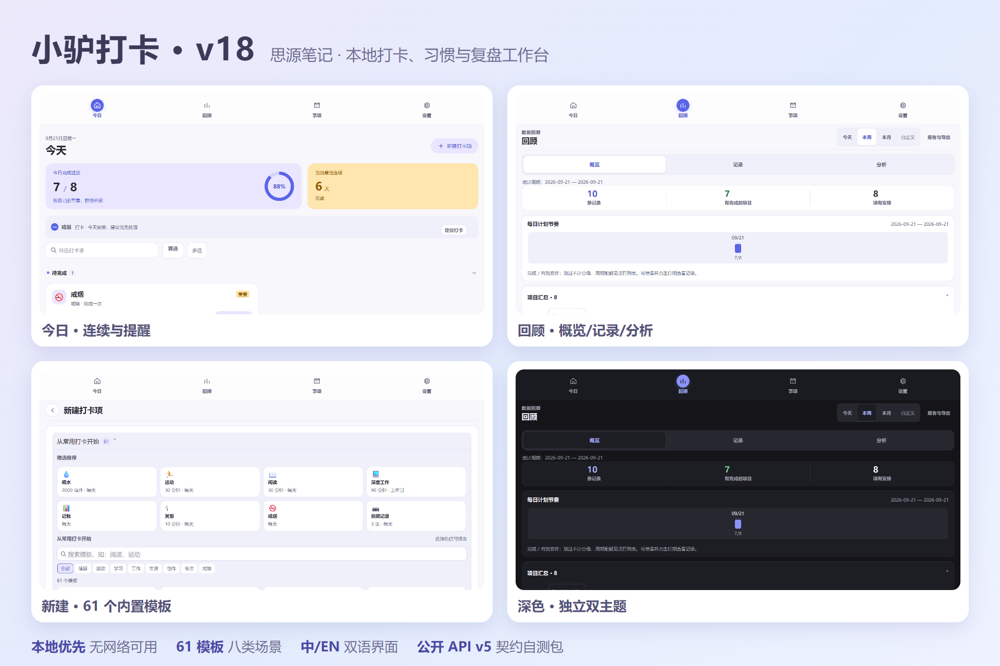

<div align="center">


# 小驴打卡

**思源笔记里的本地优先习惯、打卡与复盘工作台**

把一次行动记录下来，再用同一份可追溯数据完成统计、提醒、复盘和笔记联动。

**当前版本：18.13.0**

18.13.0 交付「代码质量与用户反馈」批次：设置页目标卡全宽单列修复（逐字竖排/挤压消除）、统一文档选择器覆盖全部绑定入口（五张卡+笔记本变体）、设置页字体层级三档令牌归一、SurfaceContext 读侧扩参至契约全形状、CSV 截断警告与i18n 修复等 7 项质量/体验收口。后续重点是真机验收、Task Horizon 等生态联调与按实际问题立项的小步迭代；进度见 [PROGRESS](PROGRESS.md)。

[最新 Release](https://github.com/ai68298100/siyuan-checkin/releases/latest) · [18.13.0 发布说明](docs/releases/release-notes-18.13.0.md) · [问题反馈](https://github.com/ai68298100/siyuan-checkin/issues) · [开发文档](docs/)

</div>

<div align="center">

</div>

## 小驴系列与交流

目前已开发的四款插件：**小驴雷切**、**小驴打卡**、**小驴人脉**、**小驴拾遗**。

交流 QQ 群：**871707735**。

## 适合什么场景

小驴打卡适合想在思源里维护习惯、行动记录和复盘资料的人。它支持二值完成、次数、时长、数量、自定义单位和戒除类目标；数据保存在本地，统计和导出不依赖网络或 AI。

插件提供桌面页签、dock、快速弹窗和移动端入口。桌面端可在命令面板执行「打开小驴打卡页签」，或在「设置 → 外观与交互 → 默认打开方式」选择页签：页签可固定在布局、与文档分屏，并随布局重启恢复。移动端使用单列内容、底部导航、安全区和软键盘适配，长内容由回顾、设置等页面自己的滚动区域承载。

## 核心功能

| 页面 | 可以做什么 |
| --- | --- |
| **今日** | 按分组、优先级和搜索查看今日机会；一键完成、`+1`、快捷增量、精确记录、跳过、撤销和拖动排序。已完成区域支持展开/折叠。「那年今天」回顾往年同日的打卡与事项。 |
| **回顾** | 查看日/周/月/自定义范围的总结、趋势、热力图、日志、强度、周期对比、成就、提醒和行动建议；可导出 JSON、CSV、Markdown 与年度分享图。 |
| **新建** | 配置类型、目标、单位、计划、步长、时间段、来源、分组和图标；内置模板、最近使用、场景组合包和“我的模板”可直接复用。按名称智能联想模板与字段；「步数/体重/阅读/问卷日记」模板提供联动绑定建议；推荐位按已有项目动态生成互补建议；支持空状态一键装填与「保存并继续」。 |
| **日期事项** | 管理生日、纪念日、账单、续费、节日等一次性、周期或农历事项；纪念日自动派生「满 N 天/个月/周年」里程碑与自然历跨度，长周期事项显示本周期进度；支持单次改期与错过补标记；可查看逾期、即将到来的提醒和「那年今天」回顾。 |
| **归档** | 搜索、恢复或删除不再参与今日计划的项目；归档不会删除历史事件。 |
| **设置** | 管理主题、语言、减少动效、默认打开方式、日记/笔记联动、第三方来源、备份恢复、诊断、审计和显示偏好。 |

### 18.13.0 重点

- **目标卡全宽单列**：目标卡在所有容器宽度恢复单列卡面——≥720px 摘要逐字竖排与挤压彻底消除；五卡退役 `settings-row` 复用类，行栅格不再与卡竞争。
- **统一文档选择器扩展**：问卷 doc 模式与叶归笔记本卡接入统一选择器；候选列表 id 序列化（多 root 安全）。
- **设置页字体层级**：分组折叠头字重归一（640→650 strong 档）；三档探针留档确认跨档一致。
- **CSV 截断警告**：导入超 20000 行上限的文件时确认前显示截断警告（双语），不再静默丢弃。

<details>
<summary>18.12.0 重点</summary>

- **统一文档选择器**：全部绑定入口（日记/摘要/健康/问卷/叶归笔记本）换用单搜索框+候选行列表（名称/路径双行预览、↑/↓ 环选、Enter 选中、IME 安全），旧「按钮+下拉」双框全部退役。
- **设置页目标卡修复**：目标卡在所有容器宽度恢复单列卡面——≥720px 摘要逐字竖排与挤压彻底消除；五卡退役 `settings-row` 复用类，行栅格不再与卡竞争。
- **设置页字体层级归一**：三档类型令牌（标题 720 / 次级强调 650 / 帮助 11px）统一设置面 12 处散布字重与帮助字号；探针双档一致验证。
- **SurfaceContext 读侧扩参**：日期/范围/工作区/查询/筛选全形状聚合，多 root DOM id 唯一化（提醒中心/事项预设），读屏关联不再串台。
</details>

历史版本重点见 [发布说明目录](docs/releases/) 与 [18.10.0 变更记录](docs/v18.10.0-change-log.md)。

## 安装与兼容性

1. 打开 [GitHub Releases](https://github.com/ai68298100/siyuan-checkin/releases)，下载对应版本的 `package.zip`。
2. 在思源中打开“设置 → 集市 → 下载安装包”，选择压缩包安装。
3. 重载插件，从顶栏按钮、命令面板、dock 或移动端入口打开。

插件清单声明的最低兼容版本：思源 v3.8.4。既有自动化真实内核验证基线为思源 v3.8.5；浏览器视觉走查覆盖桌面、移动、窄宽度和双主题，但不能替代真实 Android/iOS 客户端验收。按 D-275 不以宿主版本或真机反馈等待作为开发前置，具体兼容证据以实际验收记录为准。

首次升级前建议从设置页导出 JSON。插件不会修改思源内核，也不包含 `kernel.js`、`kernels` 或 `publish.data` 声明。

## 记录、统计与导出

支持的项目类型：

- 完成一次：点击即可记录一次二值完成；
- 按次数、时长、数量或自定义单位：支持手动精确值、快捷增量和可选专注计时；
- 戒除类目标：不记录即成功，记录即破戒，连续无破戒日按同一模型计算。

计划支持每天、工作日、指定星期、间隔天数和周期配额。跳过日、自动完成日、配额和 at-most 目标各有独立统计口径。

回顾页提供原始事件日志、统计摘要、连续记录、热力图、强度趋势、周期对比、相关性洞察、成就和建议。导出前会披露可能包含的备注、图片或来源信息；导出的文件由用户自行保存和传输。

可用的迁移与备份通道包括 JSON、CSV、Markdown 报告、Loop Habit Tracker 和 Obsidian Habit Tracker 21。格式和身份规则见[导出与导入格式总览](docs/export-formats.md)及[记录身份与多端合并规则](docs/identity-and-merge.md)。

## 笔记联动与外部来源

日记报告、摘要驻留、问卷日记、笔记锚点、叶归 LifeLog、思阅、思播、健康和微信读书均为可选联动。设置 → 外部联动中的“笔记联动总览”集中列出绑定目标类型、目标 ID、启用状态和本次会话的健康检查结果，并提供打开目标或跳到配置的入口。

所有外部来源默认关闭；Key、目标 ID 和映射只保存在本地偏好。断开来源不会删除已经落盘的事件，重新连接仍按 `source + externalRef` 幂等去重。提醒中心是插件内呈现，不承诺系统级后台通知；插件不提供云同步、社交排行榜或付费补签。

## API（`window.siyuanCheckin`）

插件公开协议名为 `siyuan-checkin`，API 版本为 5。接入方应先等待就绪，再按能力协商：

```js
const checkin = window.siyuanCheckin;
await checkin.whenReady();

if (checkin.hasCapability("events.record")) {
  await checkin.recordEvent({
    itemId: "item-id",
    value: 25,
    unit: "分钟",
    source: "my-plugin",
    externalRef: "my-plugin-session-2026-001",
  });
}
```

主要能力包括 `items.read`、`items.query`、`events.read`、`events.range.read`、`events.record`、`events.record.batch`、`summary.read`、`analytics.read`、`metrics.read`、`diagnostics.read`、`export.json`、`export.csv`、`focus.adapters` 和 `summary.providers`。写入必须由用户明确触发；批量写入、外部身份和日期范围均有上限与校验。

完整字段、能力版本和安全边界见 [API v5 参考](docs/api-v5.md)、[生态集成契约](docs/ecosystem-integration.md) 和 [Task Horizon 合作契约](docs/checkin-taskhorizon-cooperation.md)。第三方可以先运行[契约自测包](contracts/siyuan-checkin-contract/)。

## 数据安全、主题与无障碍

- 主存储、恢复点、审计、事项、模板、图标、提醒动作和分析历史分开保存；事件使用稳定 ID，外部事件使用幂等身份。
- 导入先预检和迁移校验，恢复失败会回滚内存状态并保留诊断信息；删除、批量删除和来源断开会说明影响范围。
- 设置提供跟随思源/浅色/深色三种主题、弹窗尺寸、减少动效和显示偏好重置。插件使用独立的淡紫蓝画布、白卡和紫罗兰强调色。
- 主要按钮、输入和移动导航遵循 44px 触控基线；焦点、`aria` 状态、`hidden` 状态和颜色之外的冗余编码一起维护。

## 开发与验证

环境要求：Node.js 18+、pnpm 11。

```bash
corepack pnpm install
corepack pnpm run check          # TypeScript 类型检查
corepack pnpm test               # 领域、迁移、生态和交互测试
corepack pnpm run test:ui        # UI、响应式、文档和稳定性守门
corepack pnpm run test:mobile    # 移动端布局、键盘、旋转和触控守门
corepack pnpm run test:ecosystem # API、事件和外部联动守门
corepack pnpm run test:perf      # 大量事件和投影性能基线
corepack pnpm run build          # 生产构建，输出 dist/ 与 package.zip
corepack pnpm run test:quality   # 发布前完整质量链
```

视觉和宽度走查默认使用 Playwright 安装的 Chromium。需要指定本机浏览器时可设置 `CHECKIN_BROWSER`；下面是 PowerShell 示例：

```powershell
$env:CHECKIN_BROWSER = "C:\path\to\chrome.exe"
node tests/visual-qa.cjs
$env:CHECKIN_QA_THEME = "dark"
node tests/visual-qa.cjs
node tests/width-walkthrough.cjs
```

真实思源内核 E2E 会创建带 `checkin-e2e.json` 标记的隔离工作区，不接触用户笔记本：

```bash
corepack pnpm run test:e2e
corepack pnpm run test:e2e:readonly
```

完整路线见[当前开发状态](docs/development-roadmap-current.md)和[自动化证据报告](docs/automation-evidence-report-2026-09.md)。

## 已知边界

- 浏览器和隔离内核可以发现结构、样式和数据回归，但不能替代真实思源客户端的宿主生命周期、系统键盘、安全区、页签/dock 和多窗口验收。
- 「那年今天」的往年日记跳转依赖思源自动写入的 dailynote 属性；由其他工具创建且缺少该属性的日记会提示未找到，不会误建文档。
- 思阅、思播、健康、微信读书和叶归的真实账号、Key、笔记本及上游版本需要用户在目标环境中实测；插件会在来源不可用时保持手动路径可用。
- 底栏番茄钟联动依赖上游公开兼容 API；兼容版本未安装时请使用内置计时或手动记录。
- 智能体能力依赖思源宿主公开 API，默认只读；没有模型时本地记录、统计、导入导出仍可用。

## 文档入口

- [发布说明目录](docs/releases/) · [发布与回滚](docs/release-rollback.md) · [思源兼容矩阵](docs/siyuan-compatibility.md)
- [API v5](docs/api-v5.md) · [生态集成契约](docs/ecosystem-integration.md) · [契约自测包](contracts/siyuan-checkin-contract/) · [真机验收清单](docs/integration-smoke-checklist.md)
- [架构与模块地图](docs/architecture.md) · [仓库布局规则](docs/repository-layout.md) · [导入导出格式](docs/export-formats.md)
- [低压力呈现基线](docs/low-pressure-baseline.md) · [笔记绑定盘点](docs/note-bindings-inventory.md) · [生态调研记录](docs/benchmark-habit-apps-2026-09.md)
- [当前路线](docs/implementation-roadmap-product-strategy-2026-09.md) · [UI 内容审查记录](docs/ui-full-content-audit-2026-09-20.md) · [UI 变更记录](docs/v4.0-ui-change-log.md) · [UI 路线归档](docs/archive/ui-product-roadmap.md)
- [v2.0 变更记录](docs/v2.0-change-log.md) · [v2.0 迁移说明](docs/v2.0-migration-notes.md) · [旧版 UI 路线](docs/archive/ui-redesign-roadmap.md)

## License

[MIT](LICENSE)
